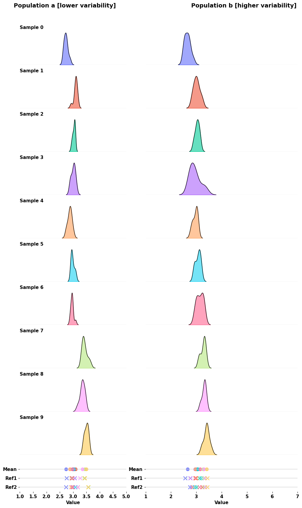
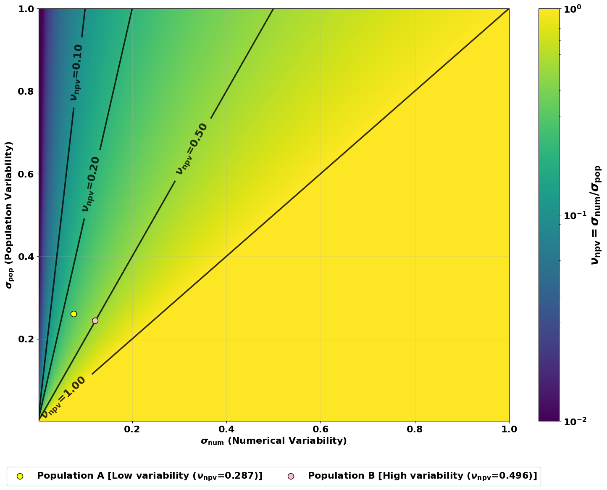
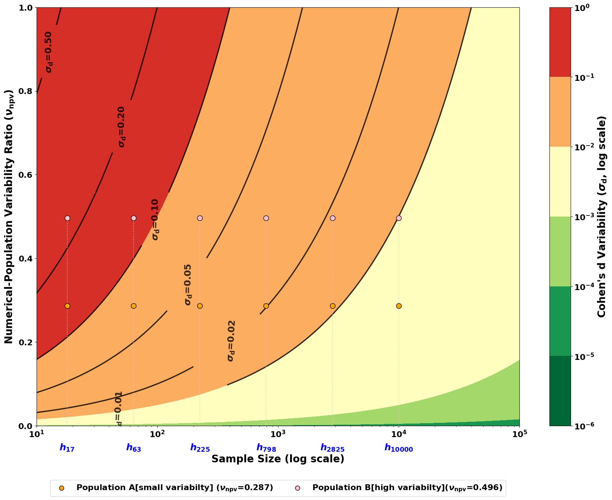
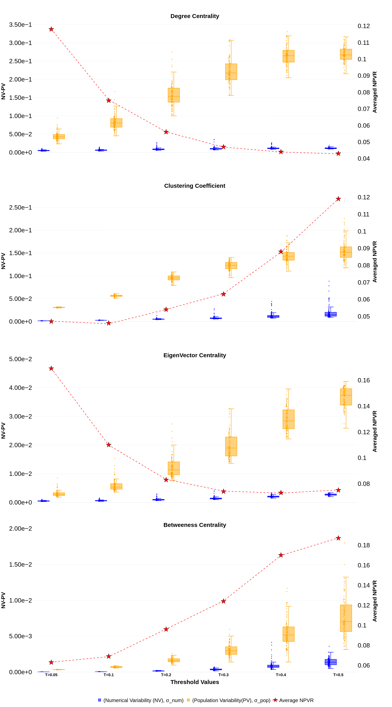
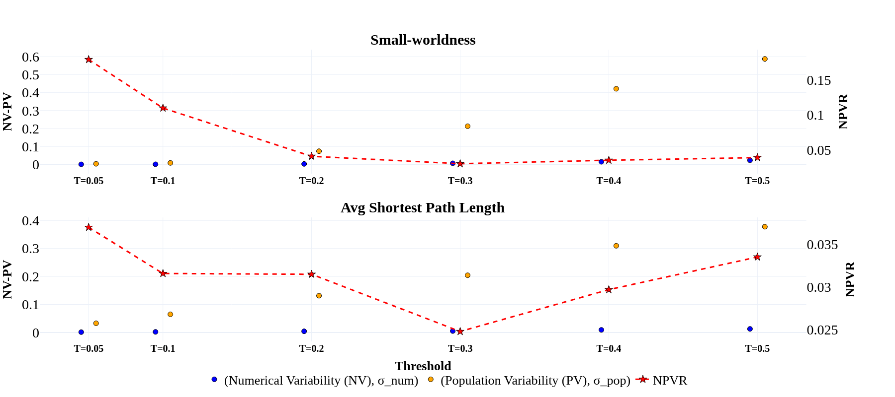
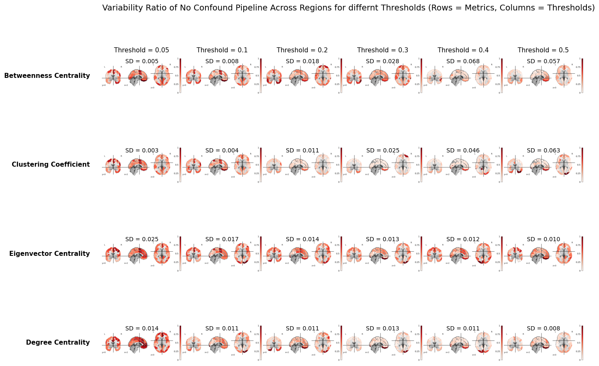
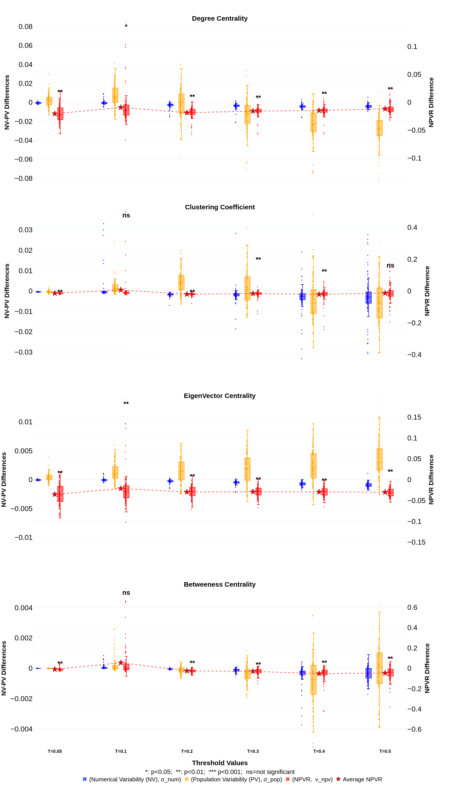
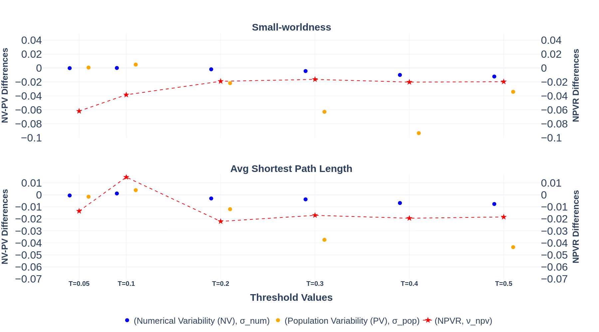

# Numerical Variability of functional MRI Graph Measures Summary
> Written by Mina Alizadeh, Yohan Chatelain, Gregory Kiar and Tristan Glatard (see [here](https://www.biorxiv.org/content/10.64898/2025.12.22.695524v1)).

Please note that some sentences, in this summary are taken as is from the research paper, as it's sometimes difficult to summarize some sentences.

## Abstract

As pipelines become more computationally heavy, it's important to access for numerical stability to ensure results remain within an representative and acceptable range.

The results of the stability evaluation were a Numerical-Population Variability ratio expressed as:

$$NPVR = \frac{\sigma_{num}}{\sigma_{pop}}$$

Where $\sigma_{num}$ is the numerical variability and $\sigma_{pop}$ is the population variability.

ranging from 0.1 to 0.2.

It's also important to note that this ratio varies across the brain regions.

## Introduction

The following are a known cause for numerical perturbations:
 - differences in hardware architecture
 - operating systems
 - compilers
 - parallelization strategies

They are more and more present in pipelines involving high-dimensional computations such as linear and non linear image registration or the training of DL models.

Studies such as  Mirhakimi et al., 2025 Chatelain et al., 2025 and Kiar, Chatelain, et al., 2020 have already studied the numerical variability of structural and diffusion MRI pipelines. Yet, it's impact on functional MRI pipelines are currently unexplored. This paper aims to assess how numerical perturbations affect the reliability of functional connectivity matrices and graph metrics across multiple datasets and pre-processing configurations.

## Materials and Methods

The `fMRIPrep` pipeline was used as the preprocessing framework on the PPMI dataset with a focus on cross-sectional analyses. The numerical variability was introduced with Monte Carlo Arithmetic (MCA) via `fuzzy lib math`, a technique that brings small perturbations to the the floating point operations, which allows to quantify how much variability comes from numerical errors.

### Dataset

Individuals with available resting state (rs) FMRI data were selected from the PPMI dataset, including patients with and without Parkinson's disease (PD).

Only the right left (RL) runs of the 38 healthy controls and 147 Parkinson's patients was analyzed. The RL rs-FMRI acquisition takes 240 volumes with 10 minutes of total scan time.
Here are the different settings of the acquisition phase:
 - The repetition time (TR) is 2500ms. 
 - The echo time is 30ms.
 - The slice thickness is 3.5mm.
 - There were 40 axial slices.
 - The field of view (FOV) is 224x224mm.
 - The matrix size is 64x64.
 - Participants were instructed to close their eyes and remain still.

The data was converted from `DICOM` to `NIfTI` with `HeuDiConv 1.2`

### Data Processing

The data were processed using `fMRIPrep 23.2.1`. The following operations were applied to
  - T1-weighted images:
    - Intensity non-uniformity correction
    - Skull stripping
    - Tissue segmentation
    - Non linear normalization to the MNI152NLin2009cAsym template
  - BOLD time series
    - Generation of a BOLD reference volume
    - Head motion correction
    - Co-registration of the BOLD references to the T1-weighted image with boundary-based registration
    - Transformation into MNI space using the composed anatomical and functional transformations

[comment]: <> TODO: Add the confound regressor fMRIPrep produced

After the preprocessing, functional connectomes were generated with `Nilearn`.
Regional time series were extracted using `NiftiLabelsMasker` applied to the preprocessed BOLD images with the Schaefer 2018 parcellation with 100 cortical regions and 7 functional networks. A Spatial smoothing of 6mm FWHM and temporal standardization were applied during masking.

Then 2 versions of the functional connectome were created for each subject and each MCA run:
  - One with confound regression of the 6 main sets of motion parameters (translations and rotations)
  - One without confound regression isolating numerical variability arising solely from preprocessing.

For each version, a Pearson correlation matrix was computed using Nilearn's `ConnectivityMeasure` resulting in 1 functional connectivity matrix per subjet per MCA run.

### Graph Metrics

Since correlation matrices are complete graphs, 6 correlations values were used as threshold (0.05, 0.1, 0.2, 0.3, 0.4, 0.5) to then generate binarized adjacency matrices.

Then based on those networks, 4 local graph metrics were computed:
  - Degree centrality
  - Clustering coefficient
  - Betweenness centrality
  - Eigenvector centrality

As well as 2 global metrics:
  - Small-worldness
  - Average shortest path length

All measures were computed using `Python 3.12` and `Network 3.5`.

### Evaluation of Numerical Variability

The fMRIPrep pipeline was repeated 10 times per subject, allowing to gather a distribution of outputs that have the expected numerical variability across OS or library configurations.

### Numerical variability measures

Here is how the NPVR is calculated in details:

$$
  \sigma_{num}^2 = \frac{1}{m} \sum_{j=1}^m \left[ \frac{1}{n-1} \sum_{i=1}^n \left( x_{i,j} - \bar x_{.,j}\right)^2\right]
$$

$$
  \sigma_{pop}^2 = \frac{1}{n} \sum_{i=1}^n \left[ \frac{1}{m-1} \sum_{j=1}^m \left( x_{i,j} - \bar x_{i,.}\right)^2\right]
$$

$$
  NPVR = \frac{\sigma_{num}}{\sigma_{pop}}
$$

It can also be noted that it's possible to approximate the std of Cohen's $ d\left( \sigma_d \right) $ as follow

$$
\sigma_d = \frac{2}{\sqrt{n}}NPVR
$$

Where $\sigma_{num}$ is the numerical variability, $\sigma_{pop}$ is the population variability, $x_{i,j}$ is the measurement for subject $j$ in MCA repetition $i$, $\bar x_{.,j}$ and $\bar x_{i,.}$ are column and row means, $n$ is the total number of MCA repetitions and $m$ is the number of subjects.

Higher NPVR values indicate regions where computational variability potentially
compromises the detection of true population differences

## Results

### The influence of numerical variability on statistical inference

For illustration of how numerical noise can influence statistical inference and experiment design, 2 synthetic populations of 10 subjects were generated with a "low" and "high"variability conditions with the same mean.

Here are the results (taken directly from the paper [repository](https://github.com/mina94az/Numerical-Variability-of-functional-MRI-Graph-Measures))

Figure 1c shows the relative contribution of inter subject numerical variability.

Figure 1d demonstrates how numerical variability propagates into effect size estimation. With small sample size (n < 100) higher NPVR values lead to larger Cohen's $delta$ ranging from 0.1 to 0.5. In contrast, lower NPVR conditions yield smaller dispersion, with σd values range from 0.05 to 0.2. As sample size
increases, the variability in effect size estimates diminishes for both high- and low-NPVR settings.

These results make explicit direct link between numerical variability and effect size variability.

###  Numerical variability varies across graph statistics and network thresholding decisions

Here are the results for the different graph metrics established in the previous section

For each metric, each plot shows the mean NPVR computed across 100 nodes, as well as numerical and inter subject variability values.

For the local graph metrics, the NPVR ranged from 0.04 to 0.18. For the global ones it ranged from 0.02 to 0.17. As the the thresholds increased, the clustering coefficient and between centrality NPVR increased, while it decreased for the degree and eigenvector centrality. This suggest that the numerical variability grew faster than the inter-subject one, and that the inter-subject variability dominated.

For the global graph metrics, small-worldness and average shortest path length showed higher NPVR at a threshold of 0.05, followed by a decrease up to 0.3, and a subsequent rise, more pronounced for the average shortest path length.

Even if the numerical variability remains smaller than the inter subject variability, it can still influence group-level inference, particularly in small sample studies. For instance a NPVR of 0.18 for between centrality at threshold 0.5 can approximate the Cohen's $d$ and implies that it may require more than 1000 subjects.

### Regional variation in NPVR interacts with threshold decisions

The following figure shows a regional map of the NPVR for all the local graph metrics across thresholds.

For lower thresholds, degree centrality and eigenvector centrality exhibit slightly higher NPVR values with increased variability across regions. In contrast, for clustering coefficient and betweenness centrality, higher thresholds tend to produce substantially larger NPVR magnitudes, accompanied by pronounced regional outliers. The spatial variability is also greater for these metrics at higher thresholds, reflecting more localized and extreme numerical variability.

This highlights that the numerical variability is not uniformly distributed across the different brain regions. Therefore, inference drawn from regional graph metrics may be differentially affected by numerical variability.

### Trade-offs of Using Confound Removal

Figures 5 and 6 show the results for the local and global metrics obtained by doing with-confound metrics minus no-confound metrics across thresholds.

As we can see on Figure 5, the same overall trends can be seen across the with or without confound pipelines.

The difference plots of the NPVR (purple boxplots) are predominantly negative, as are the differences in region-averaged NPVR (red stars), suggesting lower numerical variability in the no-confound pipeline relative to the with-confound pipeline across most metrics and thresholds.

Permutation tests applied to each NPVR distribution confirmed that these differences were statistically significant and consistently negative, supporting the conclusion that confound regression increases numerical variability in this setting. However, this reduction in numerical variability does not necessarily imply better validity: removing confound regression may complicate the interpretation of the resulting connectivity estimates and could compromise the accuracy of the derived functional connectomes.

### Discussion

In this research, it showed that numerical variability from floating point arithmetic can influence functional connectomes and graph metrics.

Our findings reveal that the numerical variability is not uniform across brain regions and metrics. However it consistently range between 0.1 and 0.2. This suggests that numerical variability may interfere with downstream analyses, particularly in studies with small sample sizes and when measuring small effect sizes.

Even modest numerical variability on the order of NVPR = 0.1 can introduce variability in Cohen’s d effect size estimation in the range of [0.01, 0.1],as shown in Figure 1c.

Similar NPVR value ranges were seen in structural MRI. This range provides
a useful reference point for contextualizing results in the current literature and for approximating the variability that propagates into downstream analyses, including its impact on statistical inferences such as effect sizes, F-statistics, and other measure.

However, the NPVR values reported in this study will likely change across multiple factors:
  - The chosen preprocessing and processing pipeline
  - The task or resting state paradigm
  - Sample characteristics
  - Neurobiological properties of the studied population
  - ...

Prior work showed that linear registration exhibits marked numerical variability across runs, and that the FastSurfer deep-learning pipeline does not yield lower numerical variability than the FreeSurfer workflow.

Understand how NPVR interacts could motivate new quality control strategies or the development of computational biomarkers.

Future work could explore how network sparsification and different thresholding methods influence the NPVR of graph measures. The results suggest that an intermediate threshold (around 0.2) consistently minimizes NPVR across metrics.

[comment]: <> TODO: Add more details to the conclusion ?

## Data and Code availability

The unprocessed data set is available [here](https://www.ppmi-info.org/access-data-specimens/download-data).

DICOM images were converted to NIfTI format, as required for fMRIPrep inputs, using HeuDiConv (version 1.2) on the Narval cluster hosted by Calcul Quebec.

The source code is available [here](https://github.com/mina94az/Numerical-Variability-of-functional-MRI-Graph-Measures).

Floating-point perturbations were introduced using the fuzzy-libmath instrumentation. The documentation and container image are available [here](https://github.com/verificarlo/fuzzy/tree/master#fuzzy-libmath).

All preprocessing was performed with fMRIPrep (version 23.2.1) instrumented with fuzzy-libmath, on the Narval cluster hosted by Calcul Quebec.

Functional connectomes were generated using Python scripts available in the GitHub repository and were executed on the Rorqual cluster hosted by Calcul Qu´ebec, using Python 3.12 and the NetworkX (version 3.5) library. Downstream analyses were performed locally on a computer running Ubuntu 22.04.5 LTS,
using Python 3.11.
